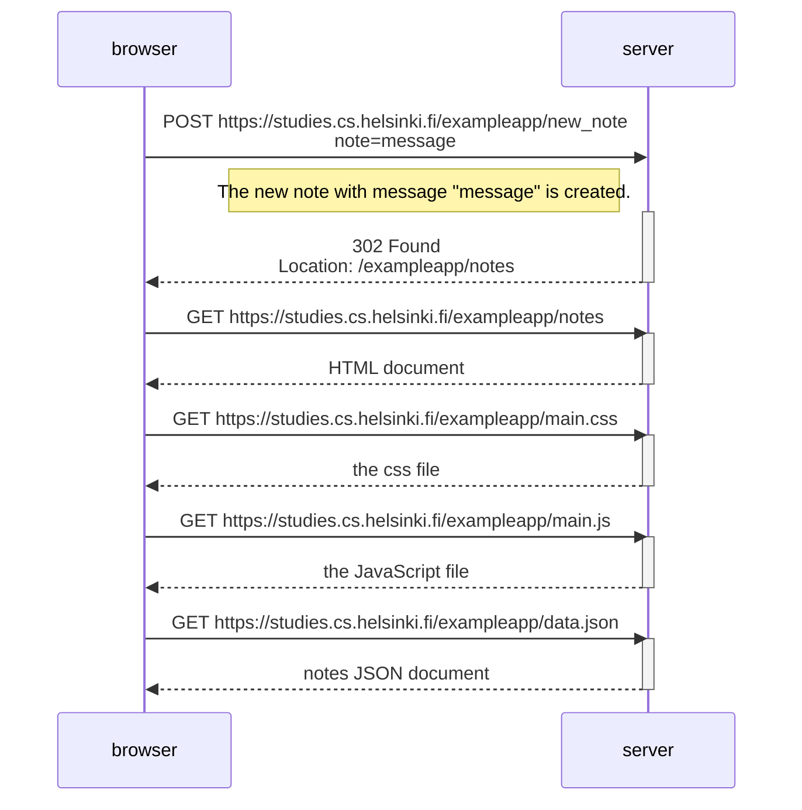

```mermaid
sequenceDiagram
    participant browser
    participant server
    browser->>server: POST https://studies.cs.helsinki.fi/exampleapp/new_note <br> note=message
    
    Note left of server: The new note with message "message" is created.

    activate server
    server-->>browser: 302 Found <br> Location: /exampleapp/notes
    deactivate server

    participant browser
    participant server
    browser->>server: GET https://studies.cs.helsinki.fi/exampleapp/notes
    
    activate server
    server-->>browser: HTML document
    deactivate server

    browser->>server: GET https://studies.cs.helsinki.fi/exampleapp/main.css
    activate server
    server-->>browser: the css file
    deactivate server

    browser->>server: GET https://studies.cs.helsinki.fi/exampleapp/main.js
    activate server
    server-->>browser: the JavaScript file
    deactivate server

    browser->>server: GET https://studies.cs.helsinki.fi/exampleapp/data.json
    activate server
    server-->>browser: notes JSON document
    deactivate server
```
