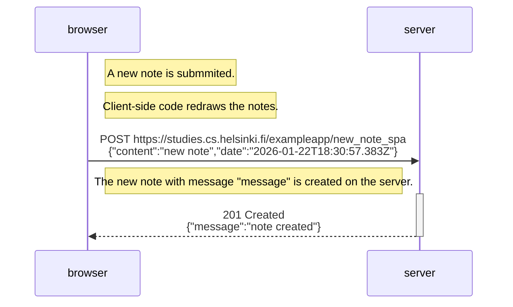

```mermaid
sequenceDiagram
    Note right of browser: A new note is submmited.
    Note right of browser: Client-side code redraws the notes.

    participant browser
    participant server
    browser->>server: POST https://studies.cs.helsinki.fi/exampleapp/new_note_spa <br> {"content":"new note","date":"2026-01-22T18:30:57.383Z"}
    
    Note left of server: The new note with message "message" is created on the server.

    activate server
    server-->>browser: 201 Created <br> {"message":"note created"}
    deactivate server
```
